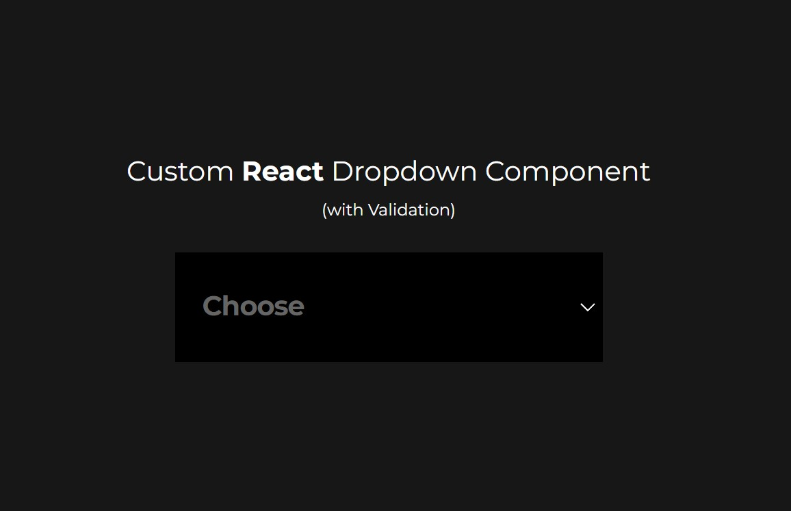
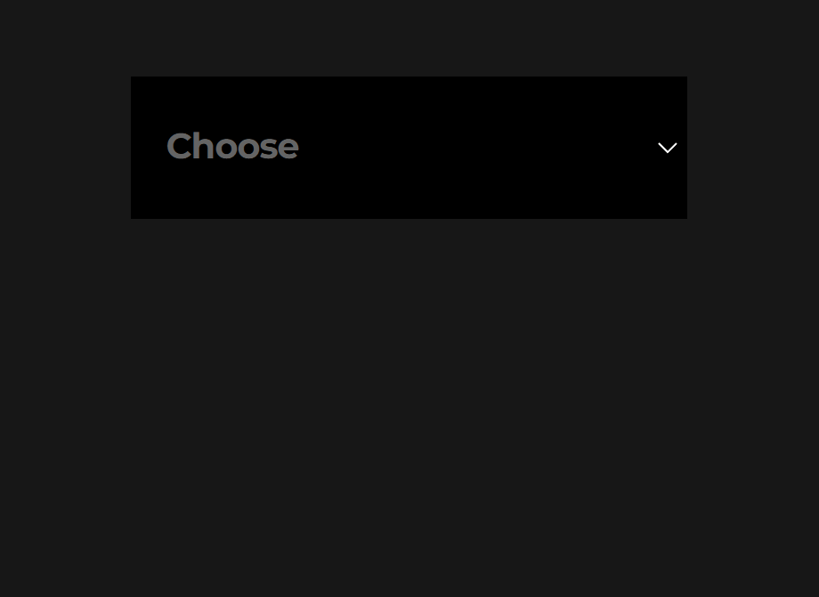
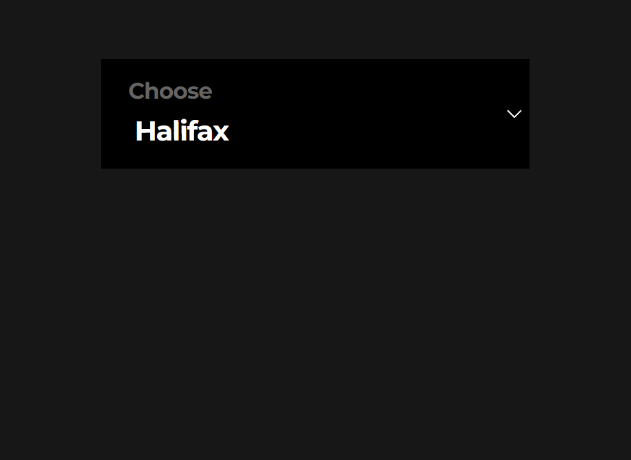

 

  
  <h3 align="center">React Dropdown Field Component</h3>

  
  
  A dynamic React.js Dropdown Field, with built-in validation.
     
    <a href="https://github.com/Afrokk/Mini-WebDev-Projects/tree/main/React%20Input%20Field%20(with%20Validation)"><strong>Check it out.»</strong></a>
     
  

## About & Features

A custom React Dropdown field component, built from scratch using TypeScript, JSX and SASS. 
* Fully reusable and dynamic.
* Built-from-scratch, and custom. Lightweight. 
* Beautiful, custom animations. 
* Custom styles upon validation. 
* Live input validation.
* Can be used as a regular dropdown field too, validation is fully optional.
* Completely customzable.

## Built With

Designed and built with:

* [![React][React.com]][React-url]
* [![TypeScript][TypeScript.com]][TypeScript-url]
* [![SASS][SASS.com]][SASS-url]
* [![JavaScript][JavaScript.com]][JavaScript-url]

## How it works & looks
Works with the React props supplied. Required prop enables validation, defaultSelected prop enables partial validation, and neither disable validation.

### With validation:

  

### Partial validation:

  

### Without validation (regular text field):

  

## Contact

Afrasiyab (Afrokk) Khan -  [afrokk.design](https://afrokk.design/home) - [LinkedIn](https://www.linkedin.com/in/afrasiyab-k/) - [@afrokk_](https://www.instagram.com/afrokk_/) - afrasiyabkhan379@gmail.com

ANOTHER PROJECT: Check out <strong>Vintage Autohaus</strong>: [https://github.com/Afrokk/Vintage-Autohaus](https://github.com/Afrokk/Vintage-Autohaus)

[product-screenshot]: images/clip.jpg
[React.com]: https://img.shields.io/badge/React-20232A?style=for-the-badge&logo=react&logoColor=61DAFB
[React-url]: https://reactjs.org/
[TypeScript.com]: https://img.shields.io/badge/TypeScript-007ACC?style=for-the-badge&logo=typescript&logoColor=white
[TypeScript-url]: https://www.typescriptlang.org/
[SASS.com]: https://img.shields.io/badge/Sass-CC6699?style=for-the-badge&logo=sass&logoColor=white
[SASS-url]: https://sass-lang.com/
[JavaScript.com]: https://img.shields.io/badge/JavaScript-323330?style=for-the-badge&logo=javascript&logoColor=F7DF1E
[JavaScript-url]: https://en.wikipedia.org/wiki/JSX_(JavaScript)
